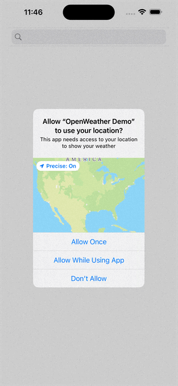

#  OpenWeather Demo

The demo project uses generics, protocols and dependency injection to increase testability. It demonstrates using UIKit and SwiftUI together in one app and uses the MVVM design pattern. There is an image caching system shown in ImageCache.swift and usage is in SearchResultsView.swift line 60. The app also saves your previously searched location and fetches it again during next launch.

